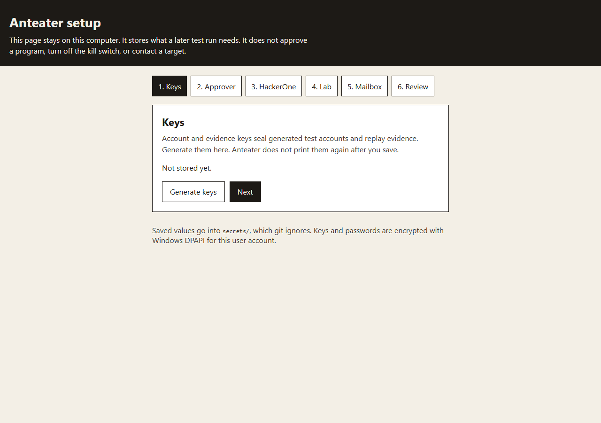
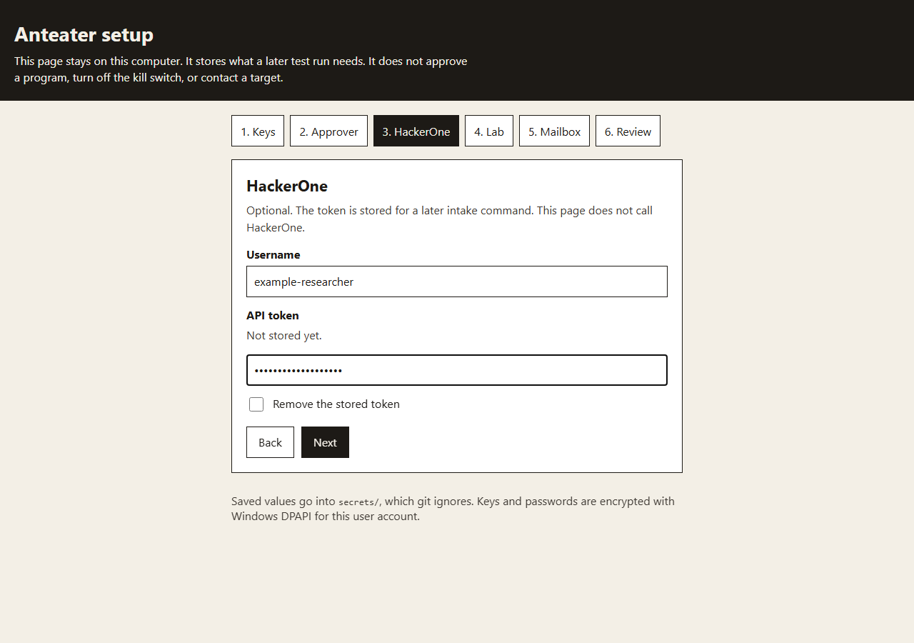
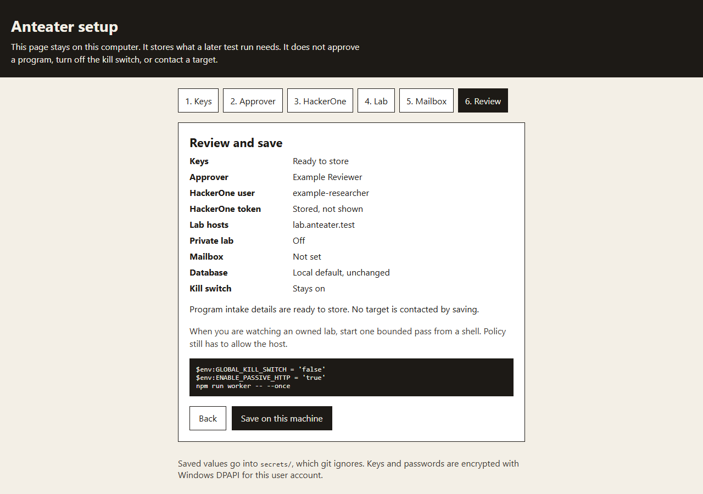
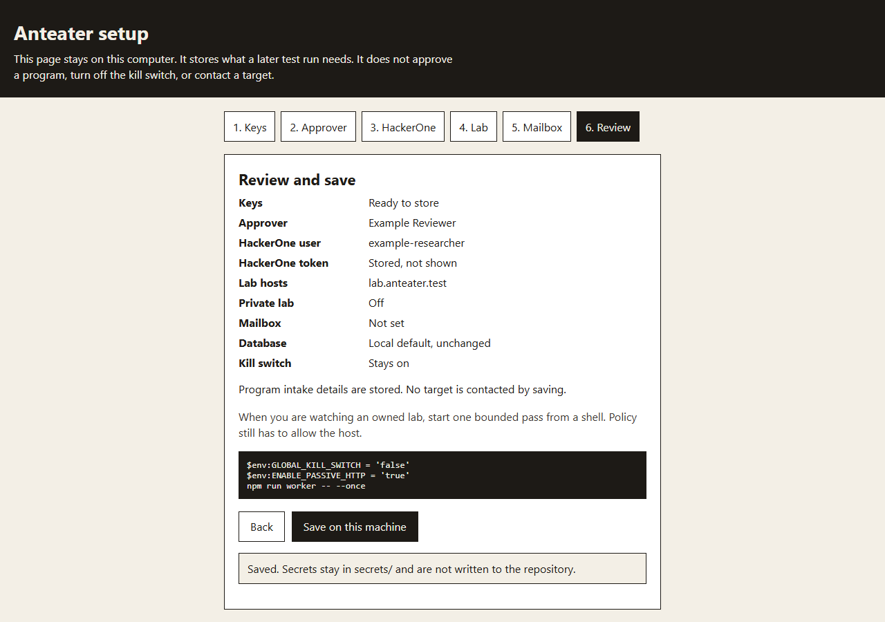
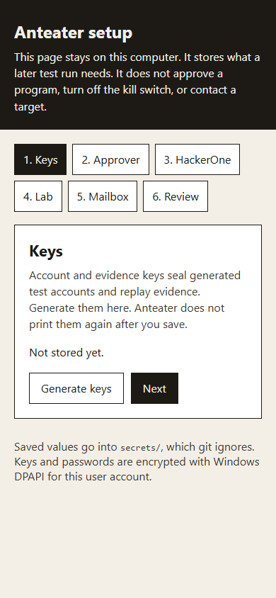

# anteater-ai

A web-development-focused, scope-first foundation for authorized web and API security research with local AI.

## Overview

Anteater stores reviewed program policy, assets, bounded jobs, observations and evidence metadata in PostgreSQL, then exports a readable Markdown workspace. The default runs a synthetic fixture. An explicitly enabled passive HTTPS adapter can collect from reviewed program manifests, propose fixed-path follow-ups, and record posture signals for operator review.

## Architecture

```text
Fixture/reviewed file -> validated policy + PostgreSQL -> concurrent leased jobs
                                                       |
                                      scope + kill switch + rate limits
                                                       |
                           fixture / bounded HTTPS GET -> durable observation
                                                       |
                  policy-filtered follow-ups + evidence + model -> Markdown export
```

See [architecture](docs/ARCHITECTURE.md), [implemented improvements](docs/EXECUTION_IMPROVEMENTS.md), [model contract](docs/DETERMINISTIC_MODEL.md), and [readiness checklist](docs/READINESS.md).

## Setup

Run `npm run setup`. Your browser opens a wizard at `http://127.0.0.1:4317/` that stays on this computer. Click through keys, the approver's name, an optional HackerOne username and token, owned-lab hostnames, and an optional mailbox. Saving does not call HackerOne, contact a lab host, approve a program, or turn off the kill switch.

The wizard encrypts the values with Windows DPAPI for the current user and writes them under `secrets/`, which git ignores. `worker`, `monitor`, `aggressive`, and `fleet` read that file when it exists. A value already set in the environment wins. `npm run verify:local` sets `ANTEATER_USE_SETUP=false`, so the fixture run ignores a setup file on the machine.

The screenshots use example text. The token is typed into a password field and is not shown again after save.









The same first step on a narrow screen:



When you are watching an owned lab, start one bounded pass from a shell. The policy still has to allow the host:

```powershell
$env:GLOBAL_KILL_SWITCH = 'false'
$env:ENABLE_PASSIVE_HTTP = 'true'
npm run worker -- --once
```

An aggressive run still needs `--snapshot-confirmed` and `--n8n-attested`, and the host still has to be in the lab list. Setup does not store those attestations.

## Bounty review inbox

Public bug-bounty platforms do not offer an anonymous API that returns domains together with the rules for testing them. The free source is the public scope dump at `arkadiyt/bounty-targets-data` (HackerOne, Bugcrowd, Intigriti, YesWeHack, and Federacy). A listed host is not permission to scan it. The inbox stores one named program at a time, with exclusions beside the in-scope assets, and the posture scanner cannot read that file.

```text
bounty:fetch one handle -> bounty-inbox.json
        |                     (JSON, no url column)
        v
bounty:review one exact host
        |
        v
bounty:promote -> targets.csv as passive only
        |
        v
posture:scan
```

| Command | What it does |
| --- | --- |
| `npm run bounty:fetch -- hackerone <handle>` | Store one program from the public dump. Also accepts `bugcrowd`, `intigriti`, `yeswehack`, and `federacy`. The inbox holds at most 25 programs. |
| `npm run bounty:list` | Show each asset as excluded, held, unreviewed, or reviewed. Wildcards and path-scoped URLs stay held. |
| `npm run bounty:review -- hackerone <handle> api.example.com` | Mark one exact in-scope host. Add `--revoke` to clear it. Exclusions, wildcards, and path-only URLs are rejected. |
| `npm run bounty:promote` | Append reviewed hosts to `targets.csv` as `passive` rows. Existing rows are left alone. |
| `npm run bounty:refresh` | Update programs already in the inbox. A host that leaves scope loses its review. The rest of the dump is ignored, and `targets.csv` is not edited. |

`npm run posture:scan -- targets.csv --policy=reviewed-policy.json` reads `url,mode,notes` only after the reviewed scope policy authorizes each row. Each row is one URL. A bare hostname is checked as `https://that-host/` only. Passive mode is one pinned GET after one TLS handshake, with at most three same-host, same-port redirects. Loopback and link-local addresses are refused. Private addresses need `--allow-private`. Aggressive rows additionally require `--confirm-aggressive`, a loopback egress proxy, and pinned Nuclei configuration. See [operating instructions](docs/OPERATIONS.md).

Schedule `bounty:refresh` only after the handles you care about are already in the inbox. Do not point that job at `posture:scan`.

## Web dependency library

The [dependency catalog](dependencies/README.md) contains **29 commit-pinned upstream repositories**: OWASP guidance, ZAP, Nuclei, HTTP discovery tools, API testing, Playwright, Lighthouse, static analysis, web wordlists, and password-strength libraries. Daily Dependabot checks propose parent-repository updates as reviewable PRs.

Run `npm run deps:sync` to fetch curated source/data checkouts, or `npm run deps:sync -- seclists zxcvbn-ts` to fetch selected dependencies. Sources live under `vendor/`; they are not automatically installed or executed. Common-password lists support offline web password-policy testing. Imported tools remain separate from the bounded passive adapter.

| Focus | Included upstream repositories |
| --- | --- |
| Secure web development | [OWASP WSTG](https://github.com/OWASP/wstg), [ASVS](https://github.com/OWASP/ASVS), [Cheat Sheet Series](https://github.com/OWASP/CheatSheetSeries) |
| Browser behavior, accessibility and performance | [Playwright](https://github.com/microsoft/playwright), [Lighthouse](https://github.com/GoogleChrome/lighthouse) |
| API contracts and testing | [Schemathesis](https://github.com/schemathesis/schemathesis), [Spectral](https://github.com/stoplightio/spectral) |
| Web application assessment | [ZAP](https://github.com/zaproxy/zaproxy), [Nuclei](https://github.com/projectdiscovery/nuclei), [Nuclei templates](https://github.com/projectdiscovery/nuclei-templates), [Nikto](https://github.com/sullo/nikto) |
| HTTP metadata, crawling and candidate hosts | [httpx](https://github.com/projectdiscovery/httpx), [Katana](https://github.com/projectdiscovery/katana), [Subfinder](https://github.com/projectdiscovery/subfinder) |
| Web paths and parameters | [ffuf](https://github.com/ffuf/ffuf), [Gobuster](https://github.com/OJ/gobuster), [dirsearch](https://github.com/maurosoria/dirsearch), [Arjun](https://github.com/s0md3v/Arjun) |
| HTTPS/TLS configuration | [testssl.sh](https://github.com/testssl/testssl.sh), [SSL Labs client](https://github.com/ssllabs/ssllabs-scan) |
| Owned source, secrets and dependencies | [Retire.js](https://github.com/RetireJS/retire.js), [Semgrep](https://github.com/semgrep/semgrep), [Gitleaks](https://github.com/gitleaks/gitleaks), [Trivy](https://github.com/aquasecurity/trivy) |
| Web wordlists | [SecLists](https://github.com/danielmiessler/SecLists), [Assetnote wordlists](https://github.com/assetnote/wordlists), [fuzzdb](https://github.com/fuzzdb-project/fuzzdb) |
| Offline password policy and strength | SecLists common-password dictionaries, [zxcvbn](https://github.com/dropbox/zxcvbn), [zxcvbn-ts](https://github.com/zxcvbn-ts/zxcvbn) |

SecLists is one repository used in two categories. Its selected password files are `10k-most-common.txt` and `xato-net-10-million-passwords-10000.txt`; its selected web data includes common paths and the small RAFT lists. These support owned web-form policy tests. Credential-pair dumps and online password-guessing workflows are not integrated.

### How updates work

- Each `vendor/*` Git submodule is pinned to an exact commit; `.gitmodules` identifies its upstream branch.
- Dependabot checks upstream repositories daily at **08:00 America/Chicago**, and npm/GitHub Actions weekly. Updates arrive as PRs, with no automatic merge or replacement of running tools.
- After reviewing and merging an update, fetch the reviewed pins locally:

  ```sh
  git -c fetch.recurseSubmodules=false pull --ff-only
  npm ci
  npm run deps:check
  npm run deps:sync
  ```

- `deps:sync` checks origins and selected paths, preserves dirty checkouts by refusing to overwrite them, and fetches curated source without running upstream installers or recursively importing their submodules.

Use a normal clone followed by `deps:sync`; recursive submodule cloning can download much larger trees, including material outside the curated selection. Sparse sources are inspection and adapter-development inputs, and may not contain everything needed to build an upstream tool. Upstream licenses remain applicable; repositories marked `REVIEW_REQUIRED` need their code/data terms reviewed before packaging. A commit pin establishes content identity, not permission to execute it.

## Current implementation and next steps

Phases 0 through 6 of the [bounty earnings plan](docs/BOUNTY_EARNINGS_PLAN.md) are in this checkout as local code with fixture proof. They are not production operation, and the plan's definition of done is not met. The Phase 1 exit — three real programs compiled and approved by a named human — is not met. On 2026-10-05 the environment had no HackerOne token, username, or named approver, so no live platform call was made and no approval was invented. The Phase 6 exit — sustained operation across 10 or more live programs, and a kill-or-pivot decision on real paid amounts — is not met. The scheduler and ledger below are fixture proof.

| In the current checkout | Still needed for production |
| --- | --- |
| `npm run setup` stores keys, an approver name, HackerOne credentials, lab hostnames, and an optional mailbox in a DPAPI-encrypted file under `secrets/`. The kill switch stays on | A named human still has to approve real programs. Setup does not contact a target |
| Reviewed domain-list profile, live campaign planner, bounded passive HTTPS collector, process egress checks, and PostgreSQL leases | Host and container egress isolation, and scheduled revisits of hosts already admitted |
| HackerOne intake limited to `https://api.hackerone.com`: injectable fetch, automation class, hash-checked approval, and `program_approvals` | A named human approving three real handles. The library does not call the live API and does not read credentials from the environment |
| Lab staging loop: a seeded IDOR is reproduced, the patched variant is rejected, and `SUBMITTED` requires a human reviewer | Impact-ranked reports and a human submission against a real program |
| Role-labeled accounts (two ordinary users and one least-privileged admin). Ownership probes build a matrix and a contract, then replay it through isolated sessions. Cross-user and cross-tenant reads are found on the vulnerable lab fixture, rejected on the patched fixture, and deleted by marker even when create returns no id | Real owned-staging validation beyond the lab fixture, and a credential service outside this checkout |
| `npm run aggressive` refuses unless the host is in `LAB_TARGET_HOSTS` and the operator passes `--snapshot-confirmed` and `--n8n-attested`. Nuclei stays on allowlisted tags with `dos,intrusive,fuzz,cve,vuln` excluded. Dropping that exclude list requires the lab host, `--allow-destructive`, and the snapshot attestation, and it records a `qm rollback` audit event. A stubbed JSONL line is stored as `HUMAN_REVIEW`, not `VERIFIED` | No Nuclei binary was executed, and nothing was sent to 192.168.60.26 |
| Campaign coverage is written to the audit chain. Replay evidence can be sealed with `EVIDENCE_KEY`. `renderReport` drafts impact, reproduction, and remediation without response bodies. `npm run triage` lists the queue. `npm run finding:submit -- --id= --reviewer=` submits one. A prior submission with the same program, type, and location hides the duplicate. An outage or failed control on retest is inconclusive | A human submitting against a real automation-permitted program |
| `npm run fleet` is a dry pass over automation-permitted programs. It honors kill, revocation, and budgets, dead-letters a non-retryable failure, and does not call tools. `npm run metrics` prints queue age, coverage gaps, rate-limit hits, tool and mailbox failures, and dead letters. `npm run backup` and `npm run restore` round-trip the submissions and dead-letter tables. An expired job lease can be claimed again. `npm run ledger` computes net as paid minus human-hours times rate minus infra from rows in `submissions` | Ten or more live programs, recorded payouts, and the production readiness boxes |
| Fourteen coverage checks and a 20-reference WSTG/ASVS registry. The live campaign reads `/.git/config`, `/.env`, and `/.DS_Store` only when the reviewed policy lists that exact path, and stores a matching signature as `OBSERVATION`. Takeover, public admin content, credentialed CORS, auth redirects, and keys in JavaScript stay gaps until those observations exist. Missing security headers are `info` | The worker process still does not issue those reads. A header nit is not a submission |
| Deterministic replay for `VERIFIED`, and a human actor plus reviewer name for `SUBMITTED` | Evidence key management |
| Budgeted discovery monitor for automation-permitted programs: certificate transparency, passive DNS, and Subfinder stay injectable; only a newly exposed in-scope host is queued | The monitor does not fetch a discovered host. A later worker does, and only for a queued in-scope asset |
| 29 pinned source/data dependencies and update checks | Reviewed runtime tool adapters, authenticated MCP, operational monitoring and recovery drills |

`GLOBAL_KILL_SWITCH` stays default-on. `ENABLE_PASSIVE_HTTP` and `ENABLE_APPLICATION_RESEARCH` stay default-off. `ALLOW_PRIVATE_LAB_TARGETS` admits a private address only for a hostname listed in `LAB_TARGET_HOSTS` while that flag is on. Loopback and link-local addresses stay blocked. These phases do not contact a real bug-bounty program.

The checked-in Kali container is an inert, network-disabled boundary demonstration. `ENABLE_PASSIVE_HTTP=true` enables only the reviewed read-only worker adapter. Application research additionally requires `ENABLE_APPLICATION_RESEARCH=true`; login, signup, resource creation and replay require `ALLOW_ACTIVE_TESTING=true` plus explicit profile paths. These switches do not replace host/container egress isolation.

The latest post-change check passed `npm run build` and **174 unit tests**, including the wizard's save and redaction tests. The setup screenshots came from a local click-through in headless Chromium. `npm run gate` was last 11/11 with 0 false positives, and `npm run verify:local` last passed before this wizard; neither was re-run for the setup page. The browser suite was last run for the ownership probes (5 tests). No research target, real login, or real mailbox was tested. `npm run aggressive` was not pointed at a live host. The `docs/READINESS.md` production boxes were not checked. See [validation details](docs/VALIDATION.md), the [production roadmap](docs/PRODUCTION_ROADMAP.md), and [readiness gates](docs/READINESS.md). Native PostgreSQL provided the local integration-test path; local Docker runtime and real model inference remain unverified.

## Quick start

Requires Node.js 22+ and Docker Compose with a running Linux engine.

```sh
npm ci
docker compose up -d --wait postgres
npm run db:migrate
npm run check
npm run test:integration
```

Run the fixture with an explicit kill-switch override:

```powershell
$env:GLOBAL_KILL_SWITCH = 'false'
npm run demo
Remove-Item Env:GLOBAL_KILL_SWITCH
```

On Bash: `GLOBAL_KILL_SWITCH=false npm run demo`.
Output is in `programs/fixture-company/`. Repeating the demo does not duplicate completed work.
Without Docker, `npm run verify:local` starts temporary PostgreSQL, runs integration tests followed by the fixture worker and demo replay, and stops PostgreSQL. It downloads no models and performs no target requests. PostgreSQL binaries are installed as a development dependency.

## Configuration

`.env.example` documents defaults. The application reads **process environment variables**, not `.env` automatically. Export values in your shell or use Node's environment-file support when invoking a script. Never commit local credentials.

| Variable | Required | Default / purpose |
| --- | --- | --- |
| DATABASE_URL | Production | Local Compose database on port 55432 |
| GLOBAL_KILL_SWITCH | No | `true`; denies tool execution |
| REQUIRE_SCOPE | No | Must remain `true` |
| REQUIRE_PROGRAM_POLICY | No | Must remain `true` |
| ALLOW_ACTIVE_TESTING | No | `false`; grants no additional worker tools |
| ENABLE_PASSIVE_HTTP | No | `false`; explicit opt-in for reviewed HTTPS collection |
| ENABLE_APPLICATION_RESEARCH | No | `false`; explicit opt-in for bounded browser research |
| CREDENTIAL_STORE | No | `secrets/accounts`; encrypted generated-account storage directory |
| ACCOUNT_KEY | No | Unset; 32-byte hex key required only for generated test accounts |
| PROGRAM_SOURCE | No | `fixture`; set `file` for reviewed manifests |
| PROGRAMS_FILE | File provider | Path to reviewed JSON; see `fixtures/programs.example.json` |
| MAX_RESPONSE_BYTES | No | `65536`; capture limit, bounded 1024–1048576 |
| MAX_CONCURRENT_JOBS | No | `1`; same setting required across all workers |
| MAX_REQUEST_RATE | No | `1`; global invocations/second, bounded to 10 |
| JOB_LEASE_SECONDS | No | `30`; bounded 5–300 |
| PROGRAMS_DIR | No | `programs`; trusted operator-owned export directory |
| OLLAMA_URL | No | `http://127.0.0.1:11434`; loopback only |
| LLM_MODEL | No | `qwen3:4b`; operator-selectable model |
| LLM_PROVIDER | No | `fixture`; set `ollama` for local classification |
| OLLAMA_MODEL_DIGEST | Production model worker | Expected `sha256:` digest recorded as provenance; installed weights are not yet verified |

## Usage

| Command | Purpose |
| --- | --- |
| `npm run setup` | Local wizard for keys, approver, HackerOne, lab hostnames, and an optional mailbox. Writes only to `secrets/` |
| `npm run check` | Compile TypeScript and run unit tests |
| `npm run test:integration` | Test a running PostgreSQL in an isolated schema |
| `npm run verify:local` | Temporary native PostgreSQL, integration tests, fixture replay |
| `npm run db:migrate` | Apply ordered, idempotent schema migrations |
| `npm run demo` | One bounded fixture iteration; explicit kill-switch override required |
| `npm run worker -- --once` | Seed reviewed root jobs and process one bounded batch with lease heartbeats |
| `npm run monitor -- --once` | One discovery cycle for automation-permitted programs. Refuses to start while `GLOBAL_KILL_SWITCH` is true. Certificate transparency uses only `https://crt.sh`. Subfinder runs only when `SUBFINDER_BIN` is an absolute path. The default passive-DNS resolver returns no names |
| `npm run research -- --domains=<file> --profile=<file>` | Queue the submitted domains using a reviewed research profile; application research must be explicitly enabled |
| `npm run test:browser` | Chromium integration tests against the synthetic research lab |
| `npm run models:inspect` | Detect NVIDIA VRAM and display conservative setup guidance |
| `npm run deps:list` | List web dependencies and committed revisions |
| `npm run deps:check` | Verify catalog, origins, branches and gitlinks |
| `npm run deps:sync` | Fetch pinned source and selected data without executing it |
| `npm run bounty:fetch -- <platform> <handle>` | Store one public program in `bounty-inbox.json` |
| `npm run bounty:review -- <platform> <handle> <asset>` | Mark one exact host reviewed |
| `npm run bounty:promote` | Copy reviewed hosts into `targets.csv` as passive rows |
| `npm run bounty:refresh` | Refresh inbox programs already fetched; does not edit the scan CSV |
| `npm run bounty:list` | Show inbox assets and their review state |
| `npm run posture:scan -- <csv> --policy=<json>` | Policy-bound posture scan; one URL per row |
| `npm run posture:check -- <url>` | Read-only check of one host, outside the CSV |

Without `--once`, the worker drains follow-ups/retries and sweeps pending exports until stopped. It loads manifests once at startup. Completed targets are not periodically rescanned; new reviewed revisions produce new jobs. The `research` entry point scans only submitted roots. `npm run monitor` is the discovery scheduler: it records every observed name and queues a passive check only for a newly exposed host the signed policy admits. A denied budget, a revoked program, or the database kill switch skips that cycle before a source is called. A profile's `reviewed: true` field is operator input, not authenticated proof of approval. See [reviewed manifest setup](docs/OPERATIONS.md#reviewed-program-worker). Authenticated HTTP/MCP control remains future work.

## Project structure

```text
apps/orchestrator/       fixture demo, concurrent worker, and live campaign planner
apps/setup/              local click-through setup wizard
packages/setup/          encrypted operator profile and DPAPI key protection
packages/application-research/ bounded browser sessions, accounts, mailbox and ownership replay
packages/program-intake/ HackerOne fetch, automation class, and reviewed compile
packages/discovery/     candidate discovery, scope admission, budgets, history, and the monitor cycle
scripts/monitor.ts       scheduled discovery; does not contact a held host
packages/coverage/      WSTG/ASVS check registry and coverage reports
packages/findings/      replay contracts, finding states, chains and retest helper
packages/scope-engine/  conservative deterministic authorization
packages/research-state/ PostgreSQL jobs, leases, rate limits, Markdown outbox
packages/bounty-providers/ fixture and reviewed manifest providers
packages/web-executor/  bounded HTTPS collector and deterministic follow-ups
scripts/bounty-inbox.ts  one-program review queue; does not feed the scanner directly
scripts/posture-scan.ts  CSV posture runner for operator-listed URLs
packages/llm/           local provider interface, Ollama adapter, fixture model
packages/agent-runtime/ structured observation analysis boundary
packages/mcp/           authorization gateway; no live MCP transport yet
packages/shared/        strict configuration and structured event logging
infrastructure/        PostgreSQL schema and disabled Kali container boundary
dependencies/          curated web dependency catalog and update policy
vendor/                pinned Git submodules, populated by deps:sync
fixtures/              synthetic .test program
tests/                 scope, configuration, models, persistence and recovery
programs/              generated research workspaces (ignored)
docs/                  architecture, operating instructions and remaining work
```

## Tech stack

- TypeScript, Node.js, Zod, node-postgres
- PostgreSQL 17 with leased jobs and transactional outbox
- Node test runner and tsx
- Docker Compose and a network-disabled Kali boundary
- Local Ollama provider abstraction; deterministic fixture model in the demo

## Notes and conventions

No secrets or research evidence in Git. No unrestricted shell or Docker socket access for agents. Markdown and model output cannot grant authorization. Assets are canonical HTTPS origins on port 443; every fixed follow-up path needs an explicit policy grant. Queries, IP literals, IDNs and ambiguous normalization are rejected; redirects are never followed by the worker. Wildcards exclude the apex and exclusions take precedence. Process-local switches, incomplete retention and other production limits are documented in the readiness checklist.

Code is provided under the [MIT license](LICENSE).
