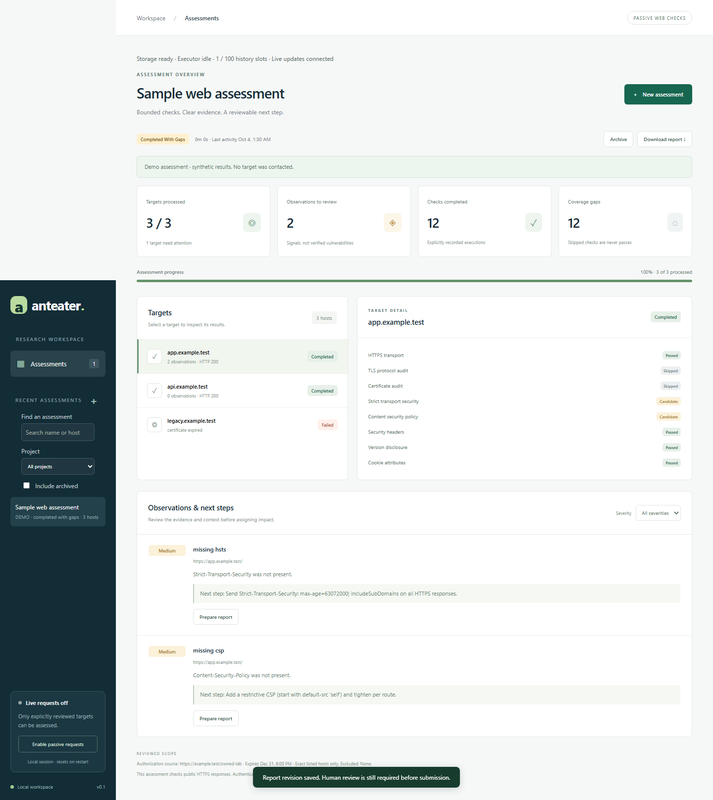
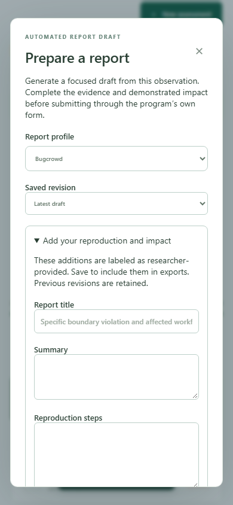
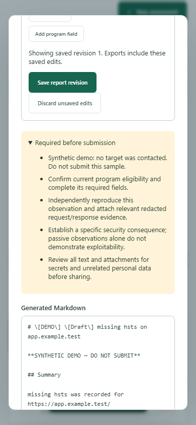

# Anteater

A local-first workspace for authorized web and API security research. Anteater combines a passive assessment dashboard, editable bounty-report drafts, a PostgreSQL-backed research worker, and controlled browser-testing modules. It is designed to make scope and evidence review visible; it does not promise findings, program acceptance, or bounty income.

## Overview

Anteater currently has two separate execution paths. The local dashboard stores assessment history and report revisions on disk and is usable without a database. The worker pipeline uses PostgreSQL for scoped jobs, leases, rate reservations, observations and audit data. An additive campaign-schema foundation exists, but the dashboard and CLI assessment flow are not yet backed by that shared queue. The default demo is synthetic; live requests are disabled until an operator explicitly enables them.

## Local dashboard

Install dependencies and start the local UI:

```sh
npm ci
npm run dashboard
```

Then open **http://127.0.0.1:4317** for a form-based workflow to review scope, follow assessment progress, inspect per-target observations and prepare bounty-report drafts. The dashboard does not require CSV editing, PostgreSQL, Docker, a frontend build, or a hosted service. Live requests start disabled; **Explore a demo** uses synthetic results only. See [dashboard instructions](docs/DASHBOARD.md).

## Screenshots

These screenshots were captured by the Chromium end-to-end suite using the synthetic demo and test transports. They show no real target data.



<p align="center">
  
  
</p>

## Features

| Area | What is implemented |
| --- | --- |
| Local assessment dashboard | Named projects and versioned scopes; recoverable drafts; exact-host exclusions; authorization source and expiry; scope-and-budget preview; explicit operator review; assessment history with search, project filter, archive and restore; live progress events; stop controls; storage/executor health. |
| Passive web checks | At most 25 exact public hostnames per assessment. Each target receives one DNS-pinned HTTPS GET on port 443, strict certificate validation, a 10-second total deadline and bounded response capture. Redirects are recorded but not followed. Private, loopback and link-local addresses are blocked. |
| Results and coverage | Per-target HTTP outcome, response metadata, observation signals, deterministic remediation suggestions and explicit check states. Skipped or unimplemented checks remain visible as coverage gaps; a signal is a candidate for review, not a verified vulnerability. |
| Report studio | HackerOne, Bugcrowd and generic coordinated-disclosure profiles; Markdown, plain text, self-contained offline HTML and JSON exports; copy/download actions; editable title, summary, reproduction, expected behavior, impact and manual custom fields; saved local revisions with source-snapshot binding and conflict checks. Reports stay labeled drafts and require human review. |
| Bounty-program inbox | Fetch one program at a time from the public scope dump, retain exclusions, manually review exact hosts, refresh scope and promote reviewed hosts as passive CSV entries. Fetching a program never grants scan permission. See [Bounty review inbox](#bounty-review-inbox). |
| PostgreSQL worker | Scoped programs/assets, leased jobs with fencing and recovery, bounded retries, shared rate reservations, invocation-time authorization checks, atomic observation/audit writes, fixed-path follow-up admission, retention controls and workspace exports. This worker is separate from the dashboard campaign flow. |
| Controlled browser research | Gated Playwright modules for isolated two-account tests, canonical-principal checks, negative controls, owner-resource replay, durable cleanup intents, optional encrypted generated test accounts and IMAP verification. These paths require separate configuration gates and owned test systems; they are not exposed by the passive dashboard. |
| Research and analysis modules | Candidate discovery/admission adapters, OpenAPI and GraphQL inventory, web/API checks, source and infrastructure analyzers, deterministic finding/retest helpers, remediation notes, evidence utilities, audit, budgets, provenance and a local Ollama provider. Many modules are libraries and are not yet joined into one live campaign pipeline. |
| Curated dependencies | 29 exact-commit-pinned upstream source/data repositories with curated paths and origin checks. A pin does not install or execute an upstream tool. See [Web dependency library](#web-dependency-library). |

## Safety and product boundaries

- Live requests and the PostgreSQL worker kill switch are off by default. Dashboard request enablement is process-local and resets on restart.
- The dashboard is a single-operator loopback application. Its scope confirmation records operator input; it is not authenticated organizational approval or a team permission system.
- Report generation makes no target requests and never uploads or submits to a platform. The JSON export contains observation metadata and hashes, not a full request/response transcript or attachment bundle. Best-effort redaction cannot guarantee arbitrary text is secret-free.
- The dashboard history and report-draft files have separate storage and retention from PostgreSQL worker observations. The old CSV posture scanner, PostgreSQL worker and local dashboard are not one unified campaign scheduler.
- Fixture and browser tests establish behavior in synthetic environments only. Owned-staging, independent egress, production recovery and real-program validation remain open work. See [readiness](docs/READINESS.md) and the [implementation ledger](docs/IMPLEMENTATION_STATUS.md).

## Architecture

```text
Local dashboard -> reviewed exact-host scope -> bounded HTTPS GET -> local history -> report draft
      |                    |                         |                    |
      +-- session         +-- expiry / exclusions   +-- no redirects     +-- human review only

Reviewed worker manifest -> PostgreSQL queue -> lease / scope / rate gates -> worker adapter
                                                                             |
                                                         observation + audit + allowed follow-ups
```

See [architecture](docs/ARCHITECTURE.md), [implemented improvements](docs/EXECUTION_IMPROVEMENTS.md), [model contract](docs/DETERMINISTIC_MODEL.md), and [readiness checklist](docs/READINESS.md).

## Bounty review inbox

Public bug-bounty platforms do not offer an anonymous API that returns domains together with the rules for testing them. The free source is the public scope dump at `arkadiyt/bounty-targets-data` (HackerOne, Bugcrowd, Intigriti, YesWeHack, and Federacy). A listed host is not permission to scan it. The inbox stores one named program at a time, with exclusions beside the in-scope assets, and the posture scanner cannot read that file.

```text
bounty:fetch one handle -> bounty-inbox.json
        |                     (JSON, no url column)
        v
bounty:review one exact host
        |
        v
bounty:promote -> targets.csv as passive only
        |
        v
posture:scan
```

| Command | What it does |
| --- | --- |
| `npm run bounty:fetch -- hackerone <handle>` | Store one program from the public dump. Also accepts `bugcrowd`, `intigriti`, `yeswehack`, and `federacy`. The inbox holds at most 25 programs. |
| `npm run bounty:list` | Show each asset as excluded, held, unreviewed, or reviewed. Wildcards and path-scoped URLs stay held. |
| `npm run bounty:review -- hackerone <handle> api.example.com` | Mark one exact in-scope host. Add `--revoke` to clear it. Exclusions, wildcards, and path-only URLs are rejected. |
| `npm run bounty:promote` | Append reviewed hosts to `targets.csv` as `passive` rows. Existing rows are left alone. |
| `npm run bounty:refresh` | Update programs already in the inbox. A host that leaves scope loses its review. The rest of the dump is ignored, and `targets.csv` is not edited. |

`npm run posture:scan -- targets.csv --policy=reviewed-policy.json` reads `url,mode,notes` only after the reviewed scope policy authorizes each row. Each row is one URL. A bare hostname is checked as `https://that-host/` only. Passive mode is one pinned GET after one TLS handshake, with at most three same-host, same-port redirects. Loopback and link-local addresses are refused. Private addresses need `--allow-private`. Aggressive rows additionally require `--confirm-aggressive`, a loopback egress proxy, and pinned Nuclei configuration. See [operating instructions](docs/OPERATIONS.md).

Schedule `bounty:refresh` only after the handles you care about are already in the inbox. Do not point that job at `posture:scan`.

## Web dependency library

The [dependency catalog](dependencies/README.md) contains **29 commit-pinned upstream repositories**: OWASP guidance, ZAP, Nuclei, HTTP discovery tools, API testing, Playwright, Lighthouse, static analysis, web wordlists, and password-strength libraries. Daily Dependabot checks propose parent-repository updates as reviewable PRs.

Run `npm run deps:sync` to fetch curated source/data checkouts, or `npm run deps:sync -- seclists zxcvbn-ts` to fetch selected dependencies. Sources live under `vendor/`; they are not automatically installed or executed. Common-password lists support offline web password-policy testing. Imported tools remain separate from the bounded passive adapter.

| Focus | Included upstream repositories |
| --- | --- |
| Secure web development | [OWASP WSTG](https://github.com/OWASP/wstg), [ASVS](https://github.com/OWASP/ASVS), [Cheat Sheet Series](https://github.com/OWASP/CheatSheetSeries) |
| Browser behavior, accessibility and performance | [Playwright](https://github.com/microsoft/playwright), [Lighthouse](https://github.com/GoogleChrome/lighthouse) |
| API contracts and testing | [Schemathesis](https://github.com/schemathesis/schemathesis), [Spectral](https://github.com/stoplightio/spectral) |
| Web application assessment | [ZAP](https://github.com/zaproxy/zaproxy), [Nuclei](https://github.com/projectdiscovery/nuclei), [Nuclei templates](https://github.com/projectdiscovery/nuclei-templates), [Nikto](https://github.com/sullo/nikto) |
| HTTP metadata, crawling and candidate hosts | [httpx](https://github.com/projectdiscovery/httpx), [Katana](https://github.com/projectdiscovery/katana), [Subfinder](https://github.com/projectdiscovery/subfinder) |
| Web paths and parameters | [ffuf](https://github.com/ffuf/ffuf), [Gobuster](https://github.com/OJ/gobuster), [dirsearch](https://github.com/maurosoria/dirsearch), [Arjun](https://github.com/s0md3v/Arjun) |
| HTTPS/TLS configuration | [testssl.sh](https://github.com/testssl/testssl.sh), [SSL Labs client](https://github.com/ssllabs/ssllabs-scan) |
| Owned source, secrets and dependencies | [Retire.js](https://github.com/RetireJS/retire.js), [Semgrep](https://github.com/semgrep/semgrep), [Gitleaks](https://github.com/gitleaks/gitleaks), [Trivy](https://github.com/aquasecurity/trivy) |
| Web wordlists | [SecLists](https://github.com/danielmiessler/SecLists), [Assetnote wordlists](https://github.com/assetnote/wordlists), [fuzzdb](https://github.com/fuzzdb-project/fuzzdb) |
| Offline password policy and strength | SecLists common-password dictionaries, [zxcvbn](https://github.com/dropbox/zxcvbn), [zxcvbn-ts](https://github.com/zxcvbn-ts/zxcvbn) |

SecLists is one repository used in two categories. Its selected password files are `10k-most-common.txt` and `xato-net-10-million-passwords-10000.txt`; its selected web data includes common paths and the small RAFT lists. These support owned web-form policy tests. Credential-pair dumps and online password-guessing workflows are not integrated.

### How updates work

- Each `vendor/*` Git submodule is pinned to an exact commit; `.gitmodules` identifies its upstream branch.
- Dependabot checks upstream repositories daily at **08:00 America/Chicago**, and npm/GitHub Actions weekly. Updates arrive as PRs, with no automatic merge or replacement of running tools.
- After reviewing and merging an update, fetch the reviewed pins locally:

  ```sh
  git -c fetch.recurseSubmodules=false pull --ff-only
  npm ci
  npm run deps:check
  npm run deps:sync
  ```

- `deps:sync` checks origins and selected paths, preserves dirty checkouts by refusing to overwrite them, and fetches curated source without running upstream installers or recursively importing their submodules.

Use a normal clone followed by `deps:sync`; recursive submodule cloning can download much larger trees, including material outside the curated selection. Sparse sources are inspection and adapter-development inputs, and may not contain everything needed to build an upstream tool. Upstream licenses remain applicable; repositories marked `REVIEW_REQUIRED` need their code/data terms reviewed before packaging. A commit pin establishes content identity, not permission to execute it.

## Current implementation and next steps

| In the current checkout | Still needed for production |
| --- | --- |
| Local form-based dashboard with saved projects/drafts, reviewed scope, progress, history, stop controls and editable report drafts | Shared PostgreSQL campaign service, team/reviewer identities, cross-process stop/revocation and managed history retention |
| HackerOne, Bugcrowd and generic report profiles with Markdown, text, offline HTML and JSON exports; local revision history | Evidence attachment manifest, integrity/readiness review, durable submission/outcome records and report lifecycle integration |
| Reviewed domain-list profile, root-job worker, bounded passive HTTPS collector and PostgreSQL leases | Authenticated policy approval, discovery-to-queue wiring, independent egress enforcement and scheduled revisits |
| Opt-in Playwright research with two isolated accounts, identity checks, optional encrypted generated accounts and IMAP verification | Real owned-staging validation, role-aware credential service, account lifecycle, and verified browser/network isolation |
| Configured owner-resource replay with negative controls and marker-based cleanup | Broader route/role coverage, live cleanup proof, persistent reviewer decisions and scheduled retests |
| Eight passive posture coverage checks, a four-reference WSTG 4.2 subset, fixture gates, API inventory and offline analyzers | Broader methodology coverage and integration of checks/inventory into the live campaign |
| Deterministic finding/retest helpers, remediation text, evidence hashes and audit data | End-to-end finding lifecycle, evidence key management, human identity and impact-ranked triage |
| 29 pinned source/data dependencies and update checks | Reviewed runtime tool adapters, authenticated MCP, operational monitoring and recovery drills |

The checked-in Kali container is an inert, network-disabled boundary demonstration. `ENABLE_PASSIVE_HTTP=true` enables only the reviewed read-only worker adapter. Application research additionally requires `ENABLE_APPLICATION_RESEARCH=true`; login, signup, resource creation and replay require `ALLOW_ACTIVE_TESTING=true` plus explicit profile paths. These switches do not replace host/container egress isolation. Findings submission remains a human-reviewed future stage.

The review-hardening implementation adds the local passive dashboard, explicit coverage execution records, canonical-principal verification, durable cleanup intents, coordinated retention, and browser CI. See [validation](docs/VALIDATION.md) and [implementation boundaries](docs/REVIEW_HARDENING.md).

## Worker quick start

Requires Node.js 22+ and Docker Compose with a running Linux engine.

```sh
npm ci
docker compose up -d --wait postgres
npm run db:migrate
npm run check
npm run test:integration
```

Run the fixture with an explicit kill-switch override:

```powershell
$env:GLOBAL_KILL_SWITCH = 'false'
npm run demo
Remove-Item Env:GLOBAL_KILL_SWITCH
```

On Bash: `GLOBAL_KILL_SWITCH=false npm run demo`.
Output is in `programs/fixture-company/`. Repeating the demo does not duplicate completed work.
Without Docker, `npm run verify:local` starts temporary PostgreSQL, runs integration tests followed by the fixture worker and demo replay, and stops PostgreSQL. It downloads no models and performs no target requests. PostgreSQL binaries are installed as a development dependency.

## Configuration

`.env.example` documents defaults. The application reads **process environment variables**, not `.env` automatically. Export values in your shell or use Node's environment-file support when invoking a script. Never commit local credentials.

| Variable | Required | Default / purpose |
| --- | --- | --- |
| DATABASE_URL | Production | Local Compose database on port 55432 |
| GLOBAL_KILL_SWITCH | No | `true`; denies tool execution |
| REQUIRE_SCOPE | No | Must remain `true` |
| REQUIRE_PROGRAM_POLICY | No | Must remain `true` |
| ALLOW_ACTIVE_TESTING | No | `false`; grants no additional worker tools |
| ENABLE_PASSIVE_HTTP | No | `false`; explicit opt-in for reviewed HTTPS collection |
| ENABLE_APPLICATION_RESEARCH | No | `false`; explicit opt-in for bounded browser research |
| CREDENTIAL_STORE | No | `secrets/accounts`; encrypted generated-account storage directory |
| ACCOUNT_KEY | No | Unset; 32-byte hex key required only for generated test accounts |
| PROGRAM_SOURCE | No | `fixture`; set `file` for reviewed manifests |
| PROGRAMS_FILE | File provider | Path to reviewed JSON; see `fixtures/programs.example.json` |
| MAX_RESPONSE_BYTES | No | `65536`; capture limit, bounded from 1,024 to 1,048,576 |
| MAX_CONCURRENT_JOBS | No | `1`; same setting required across all workers |
| MAX_REQUEST_RATE | No | `1`; global invocations/second, bounded to 10 |
| JOB_LEASE_SECONDS | No | `30`; bounded from 5 to 300 |
| PROGRAMS_DIR | No | `programs`; trusted operator-owned export directory |
| OLLAMA_URL | No | `http://127.0.0.1:11434`; loopback only |
| LLM_MODEL | No | `qwen3:4b`; operator-selectable model |
| LLM_PROVIDER | No | `fixture`; set `ollama` for local classification |
| OLLAMA_MODEL_DIGEST | Production model worker | Expected `sha256:` digest recorded as provenance; installed weights are not yet verified |

## Usage

| Command | Purpose |
| --- | --- |
| `npm run build` | Compile TypeScript and copy dashboard assets and migrations |
| `npm run start` | Serve the compiled dashboard locally |
| `npm run dashboard` | Serve the dashboard from TypeScript during development |
| `npm run check` | Compile TypeScript and run unit tests |
| `npm run test:integration` | Test a running PostgreSQL in an isolated schema |
| `npm run verify:local` | Temporary native PostgreSQL, integration tests, fixture replay |
| `npm run test:dashboard-build` | Smoke-test the compiled dashboard, assets, migrations and synthetic demo |
| `npm run test:browser` | Chromium end-to-end tests for dashboard/report workflows and the controlled research lab |
| `npm run db:migrate` | Apply ordered, idempotent schema migrations |
| `npm run demo` | One bounded fixture iteration; explicit kill-switch override required |
| `npm run worker -- --once` | Seed reviewed root jobs and process one bounded batch with lease heartbeats |
| `npm run research -- --domains=<file> --profile=<file>` | Queue the submitted domains using a reviewed research profile; application research must be explicitly enabled |
| `npm run assessment -- <command>` | List, preview, start or cancel assessments through the local dashboard API |
| `npm run models:inspect` | Detect NVIDIA VRAM and display conservative setup guidance |
| `npm run models:setup` | Inspect or configure the local model provider |
| `npm run deps:list` | List web dependencies and committed revisions |
| `npm run deps:check` | Verify catalog, origins, branches and gitlinks |
| `npm run deps:sync` | Fetch pinned source and selected data without executing it |
| `npm run bounty:fetch -- <platform> <handle>` | Store one public program in `bounty-inbox.json` |
| `npm run bounty:review -- <platform> <handle> <asset>` | Mark one exact host reviewed |
| `npm run bounty:promote` | Copy reviewed hosts into `targets.csv` as passive rows |
| `npm run bounty:refresh` | Refresh inbox programs already fetched; does not edit the scan CSV |
| `npm run bounty:list` | Show inbox assets and their review state |
| `npm run posture:scan -- <csv> --policy=<json>` | Policy-bound posture scan; one URL per row |
| `npm run posture:check -- <url>` | Read-only check of one host, outside the CSV |
| `npm run coverage:report` | Export explicit check execution and coverage gaps |
| `npm run cleanup:list` | Inspect unresolved resource-cleanup obligations |
| `npm run retention:sweep` | Apply configured retention to eligible PostgreSQL worker records |
| `npm run gate` | Run the synthetic vulnerable/patched detector fixture gate |

Without `--once`, the worker drains follow-ups/retries and sweeps pending exports until stopped. It loads manifests once at startup. Completed targets are not periodically rescanned; new reviewed revisions produce new jobs. The `research` entry point scans only submitted roots; discovery adapters are not yet wired into it. A profile's `reviewed: true` field is operator input, not authenticated proof of approval. See [reviewed manifest setup](docs/OPERATIONS.md#reviewed-program-worker). Authenticated HTTP/MCP control remains future work.

## Project structure

```text
apps/orchestrator/       fixture demo and concurrent worker
packages/application-research/ bounded browser sessions, accounts, mailbox and ownership replay
packages/campaigns/     local assessment service/repository and campaign contracts
packages/reporting/     deterministic report generation, renderers and local revisions
packages/discovery/     candidate discovery, scope admission and adapters
packages/api-inventory/ OpenAPI and GraphQL operation inventory
packages/coverage/      WSTG/ASVS check registry and coverage reports
packages/findings/      replay contracts, finding states, chains and retest helper
packages/evidence/      bounded evidence handling and integrity metadata
packages/source-analysis/ owned-code route and risky-pattern analyzers
packages/scope-engine/  conservative deterministic authorization
packages/research-state/ PostgreSQL jobs, leases, rate limits, Markdown outbox
packages/bounty-providers/ fixture and reviewed manifest providers
packages/web-executor/  bounded HTTPS collector and deterministic follow-ups
packages/web-checks/    registered web posture and API checks
packages/remediation/   deterministic fix guidance
packages/audit/         structured audit chain
packages/operations/    stop, retention and operational decision helpers
scripts/bounty-inbox.ts  one-program review queue; does not feed the scanner directly
scripts/posture-scan.ts  CSV posture runner for operator-listed URLs
packages/llm/           local provider interface, Ollama adapter, fixture model
packages/agent-runtime/ structured observation analysis boundary
packages/mcp/           authorization gateway; no live MCP transport yet
packages/shared/        strict configuration and structured event logging
infrastructure/        PostgreSQL schema and disabled Kali container boundary
dependencies/          curated web dependency catalog and update policy
vendor/                pinned Git submodules, populated by deps:sync
fixtures/              synthetic .test program
tests/                 scope, configuration, models, persistence and recovery
programs/              generated research workspaces (ignored)
docs/                  architecture, operating instructions and remaining work
```

## Tech stack

- TypeScript, Node.js, Zod, node-postgres
- PostgreSQL 17 with leased jobs and transactional outbox
- Node test runner and tsx
- Docker Compose and a network-disabled Kali boundary
- Local Ollama provider abstraction; deterministic fixture model in the demo

## Notes and conventions

No secrets or research evidence in Git. No unrestricted shell or Docker socket access for agents. Markdown and model output cannot grant authorization. Assets are canonical HTTPS origins on port 443; every fixed follow-up path needs an explicit policy grant. Queries, IP literals, IDNs and ambiguous normalization are rejected; redirects are never followed by the worker. Wildcards exclude the apex and exclusions take precedence. Process-local switches, incomplete retention and other production limits are documented in the readiness checklist.

Code is provided under the [MIT license](LICENSE).
